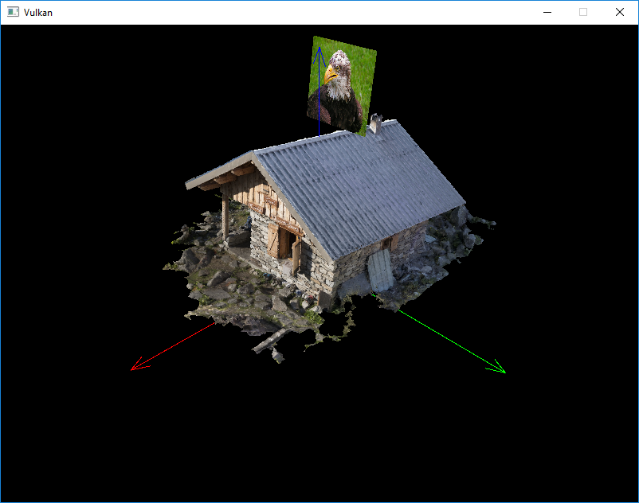

Forward Plus Rendering in Vulkan
================

**Final Project of CIS 565: GPU Programming and Architecture, University of Pennsylvania**

* [Peng Liang](https://github.com/itoupeter), [Zimeng Yang](https://github.com/zimengyang)
* Tested on: Windows 10, i7-4850 @ 2.3GHz 16GB, GT 750M (Personal Laptop)

# Forward Plus Rendering

## Forward+ Overview
Forward+ improves upon regular forward rendering by first determining which lights are overlapping which area in screen space. During the shading phase, only the lights that are potentially overlapping the current fragment need to be considered. 

## Main Procedures

*Forward Plus = forward + light culling*

Basically, in order to implement a light culling, we need to compute Grid Frustums to cull the lights into the screen space tiles.

### Grid Frustums

The screen is divided into a number of square tiles, for example, 16 * 16 screen pixels.

The [above image][1] shows that the camera’s position (eye) is the origin of the frustum and the corner points of the tile denote the frustum corners. With this information, we can compute the planes of the tile frustum.

### Grid Frustums Compute Shader

We need compute shaders to compute and grid frustums for each screen tile.

### Light culling

In the next step of the Forward+ rendering technique is to cull the lights using the grid frustums that were computed in the previous section. 

Basic algorithm for light culling:

1. Compute the min and max depth values in view space for the tile
2. Cull the lights and record the lights into a light index list
3. Copy the light index list into global memory

### Frustum culling

**Frustum-sphere** for points lights, **Frustum-cone** for spot lights.

# Vulkan 

## Milestone 
* 11/21 Basic Vulkan Application Framework

 * Vulkan environment setup and initialization
 * Basic rendering pipelines (multiple)
 * Vertex and index buffers (multiple)
 * Texture mapping (multiple) and model loading
 * Basic camera control

# References:

[1]: https://vulkan-tutorial.com/ "Vulkan Tutorial"
[2]: https://github.com/SaschaWillems/Vulkan "Vulkan Examples"
[3]: http://www.3dgep.com/forward-plus/ "Forward Plus Rendering"

