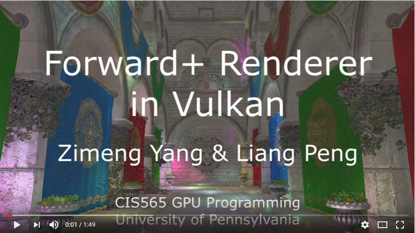

Forward Plus Rendering in Vulkan
================

**Final Project of CIS 565: GPU Programming and Architecture, University of Pennsylvania**

* Liang Peng 
 * [Github](https://github.com/itoupeter) [LinkedIn](https://www.linkedin.com/in/pennliang)
* Zimeng Yang  
 * [Github](https://github.com/zimengyang) [LinkedIn](https://www.linkedin.com/in/zimeng-yang-83602210a)
* Tested on: Windows 10, i7-4850 @ 2.3GHz 16GB, GT 750M (Personal Laptop)

# Overview


# Demo Video

[](https://www.youtube.com/watch?v=w0gTf6PKHwI)

# Forward Plus Rendering

### Forward+ Overview
Forward+ improves upon regular forward rendering by first determining which lights are overlapping which area in screen space. During the shading phase, only the lights that are potentially overlapping the current fragment need to be considered.

*Forward Plus = forward + light culling*

Basically, in order to implement a light culling, we need to compute Grid Frustums to cull the lights into the screen space tiles. The formula above is very straight forward, before applying final shading stage like we do in forward rendering, we need to cull the lights with frustums. Before compute the intersection of frustums and lights, a depth pre-pass will be applied to get the depth information for each tile.

### Depth Pre-pass

First step of Forward+ rendering is to get the depth texture of the scene. In order to get the depth information in the scene, a depth pre-pass will be applied first before the computation of frustums and lights culling. So, we create a new pipeline which only contains a vertex shader stage and the vertex shader is the same as the later final shading stage. We save the depth buffer for that pre-pass pipeline, and then pass the depth texture as an input to the next light culling pass. The depth pre-pass output looks like the same as the depth buffer texture:

|Depth Pre-pass Output|
|------|
||

After got the depth information of scene, we can pass this output texture to following compute stages.

### Grid Frustums

The second step of Forward+ rendering is to compute the frustum for each screen tile. The screen is divided into a number of square tiles, for example, 16 * 16 screen pixels. Like the following picture demonstrates:

|Grid Frustum|
|------|
||

The above image shows that the camera’s position (eye) is the origin of the frustum and the corner points of the tile denote the frustum corners. With this information, we can compute the planes of the tile frustum.

Since the grid frustums are computed in view space, so we don't need to recompute them until the size or resolution of screen changed.

### Light culling

In the next step of the Forward+ rendering technique is to cull the lights using the grid frustums that were computed in the previous section.

Basic algorithm for light culling:

1. Compute the min and max depth values in view space for the tile
2. Cull the lights and record the lights into a light index list
3. Copy the light index list into global memory

For the first task above, since we have the depth texture from depth pre-pass, we can iterate through all pixels in a single tile, and get the min/max depth value of that tile. Then we use four planes from grid frustum and two depth values for computing light-frustum culling.

The second task requires some math computation for light-frustum intersection. We use a sphere to represent point light. We only implemented point light in this project. Maybe we can add more support for different light source.

The third task is pretty straight forward, after culling the lights, we only store these lights that might intersect with the frustum into the light list of that tile. We also need a global light index list for indexing the light information in final shading stage.

A head-map can represent the results from above three steps:

|Light Heat Map|
|------|
||

For the heap-map, brighter color means more lights in tile. We use 16*16 pixels per tile. 

More details in [Forward+: Bringing Deferred Lighting to the Next Level](https://takahiroharada.files.wordpress.com/2015/04/forward_plus.pdf).

### Final Shading Stage

The last stage is final shading stage just like what we do in forward rendering. The only different is that we only iterate through the culled light list of tile instead of all lights in the scene. Shading is expensive, the number of lights in the scene might be over 1000, but after culling, we only need to consider the lights in the light list of that tile which is much much less.

In final shading stage, we implemented a Blinn-Phong shading. We also implemented the normal map, specular map and texture map. We supported different models with multiple materials. Different material might have different textures, in Vulkan, we created a new VkDescriptorSet for each single material. During the rendering stage, we group the surfaces by their material type, then use a single draw call for rendering all the surfaces with same materials. Before each draw call for different materials, we also bind the corresponding VkDescriptorSet for that material.

|Texture Map|Normal Map|
|------|------|
|||

|Specular Map|After Normal Mapping|
|------|------|
|||

After combining all the material information, we can perform a binn-phong shading, final result looks like:

|Final Result|
|------|
||


# Performance Analysis

Test schema:
 * Machine - i7-4850 @ 2.3GHz 16GB, GT 750M
 * Resolution - 1280 * 720
 * Triangles Count - 262267
 * Vertices Count - 184402
 * Materials Count - 25

### Tile Size


For the performance comparison of tile size, we choose from 8 by 8 to 256 by 256 pixels tile. Under same computation pipelines and graphics pipelines, performance data can be collected as above.

From different tests, we can see small tile size will introduce a lot of frustums to be computed and a lot of threads (compute shader) to do the computation for culling. But also a huge tile size will make the computation for each thread too heavy to make fully use of parallelization propertity of Vulkan compute shaders.

In conclusion, a reasonable tile size that fits best in different hard wares might be 16 by 16 or 32 by 32 pixels.

### Number of Lights


Under same test schema, we test the influence of different number of lights.

If we use basic Forward rendering, which is looping every in shading processure without light culling, the maximum number of lights that can be interactive is lower than 100 (under GTX 750M). But in forward+ rendering with light culling, the same machine will still be interactive with more than 1000 lights. In the deme video, which was tested under 965M a fancier graphics card, we can have near 100 FPS with 1024 dynamic lights in the scene. The benefits of forward+ light culling is very significant.

With increase of light numbers, FPS drops but still remain real-time (>30) with more than 1000 lights. So Forward+ rendering does improve the overall performance and reduce the influence of huge amount of lights in the scene by light culling.


# Milestones
### 11/21 - Basic Vulkan Application Framework
  * Vulkan environment setup and initialization
  * Basic rendering pipelines (multiple)
  * Vertex and index buffers (multiple)
  * Texture mapping (multiple) and model loading
  * Basic camera control
  * [Presentation Slides](./img/slides/milestone1.pdf)

### 11/28 - Basic Lighting in Vulkan / Debug Views
  * Debug views: depth, normal
  * Basic lighting: Lambert, Blinn-Phong
  * Compute pipeline in progress
  * [Presentation Slides](./img/slides/milestone2.pdf)

### 12/12 - Forward+
  * Compute pipeline
    * Compute grid frustum
    * Compute light list
  * Light culling
  * Shading
  * [Presentation Slides](./img/slides/milestone3.pdf)


# Install Instructions
### Windows
1. Make sure you have installed [Vulkan SDK](https://vulkan.lunarg.com/sdk/home) and environment variable __VULKAN_SDK__ correctly set.
2. Install [CMake](https://cmake.org/download/) 3.5 or later version.
3. Clone the repo, in command prompt navigate to the project root dir.
4. Run command
```
mkdir build
cd build
cmake-gui ..
```
5. In CMake GUI, configure VS2015 and generate solution.
6. Open solution, set project vulkan_forward_plus as start-up project and switch to __release mode__.
7. Run


# References 
1. [Vulkan Tutorial](https://vulkan-tutorial.com/)
2. [Vulkan Examples](https://github.com/SaschaWillems/Vulkan)
3. [Forward Plus Rendering](http://www.3dgep.com/forward-plus/)
4. [Graphics Models](http://graphics.cs.williams.edu/data/meshes.xml)
5. [Forward+: Bringing Deferred Lighting to the Next Level](https://takahiroharada.files.wordpress.com/2015/04/forward_plus.pdf)

# 3rd Party Library and Asset Credits
1. [STB](https://github.com/nothings/stb)
2. [tinyobjloader](https://github.com/syoyo/tinyobjloader)
3. [CryTek Sponza](http://www.crytek.com/cryengine/cryengine3/downloads)
4. [GLFW](http://www.glfw.org)
5. [GLM](http://glm.g-truc.net/0.9.8/index.html)
