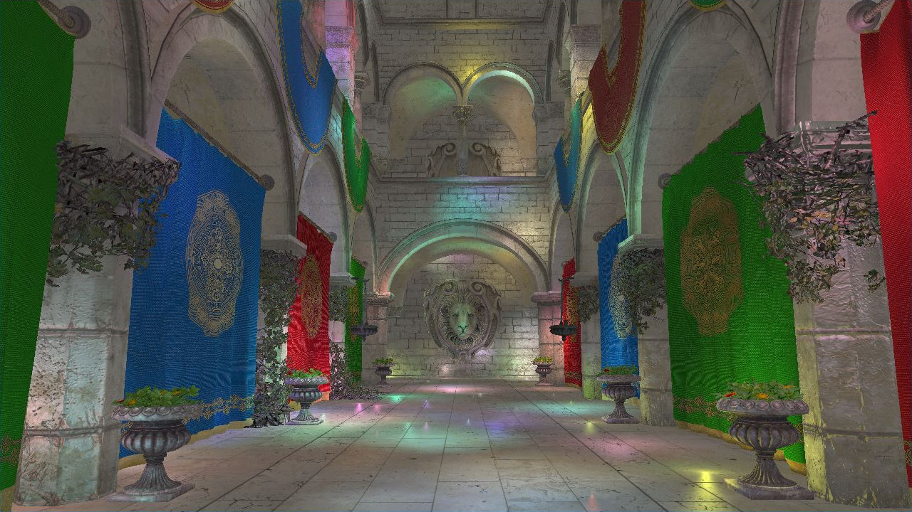
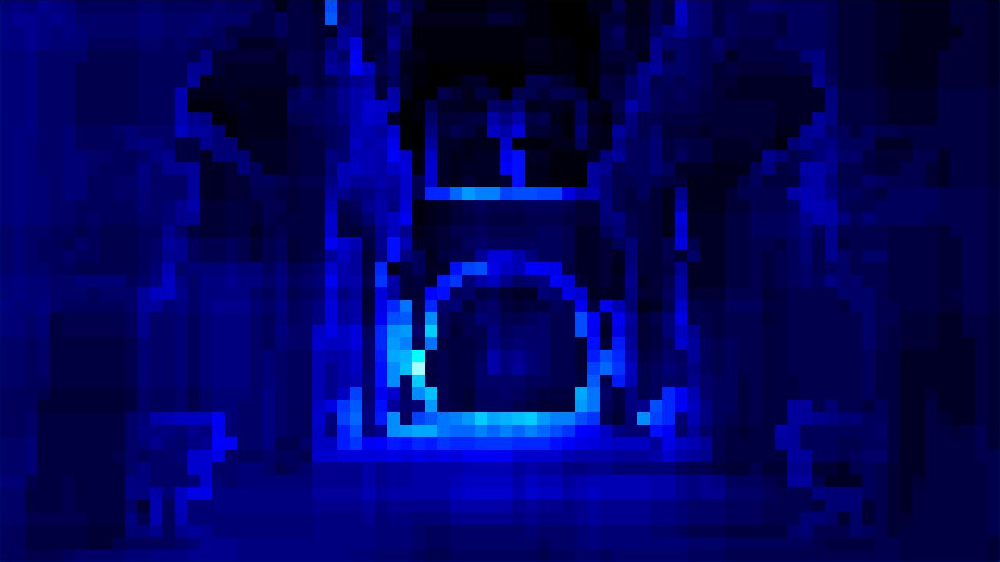
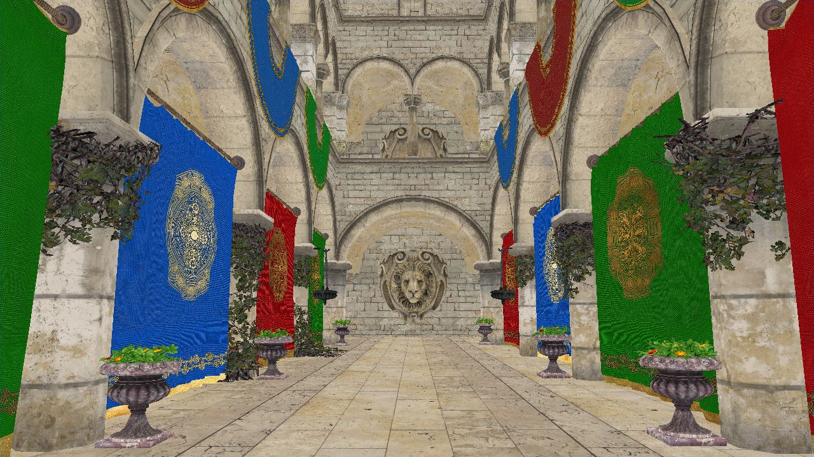
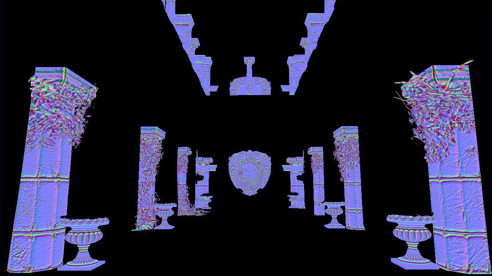
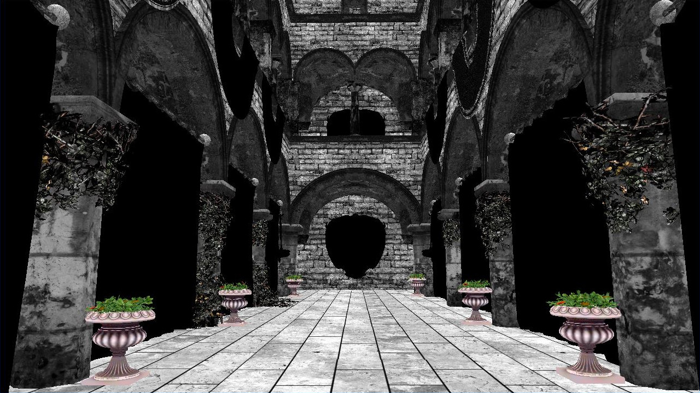
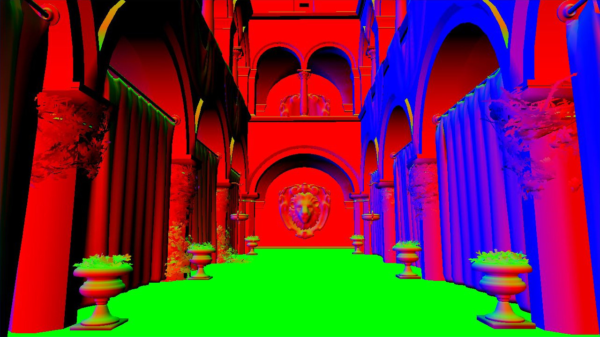
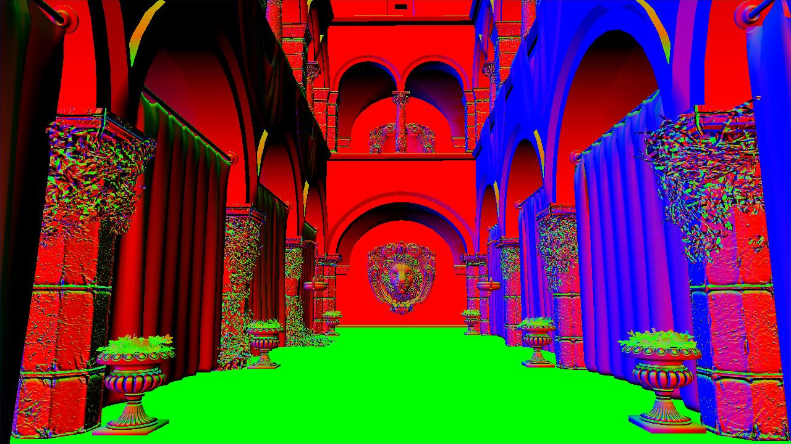
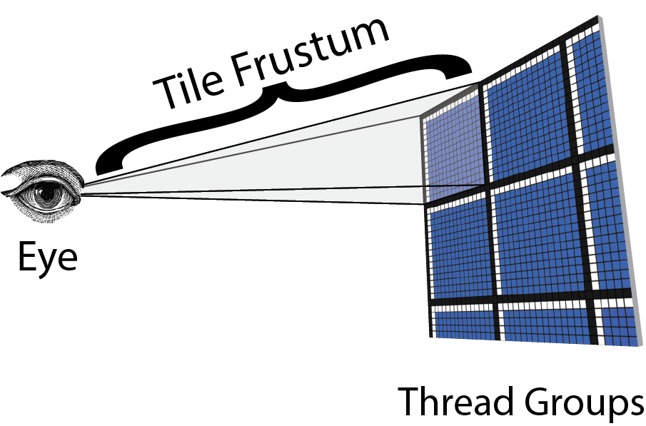
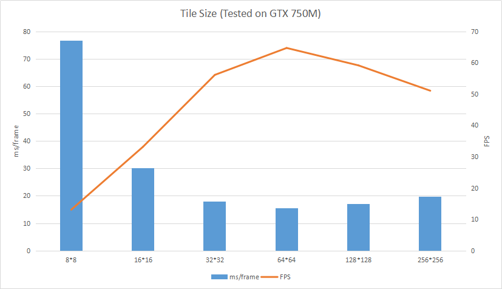
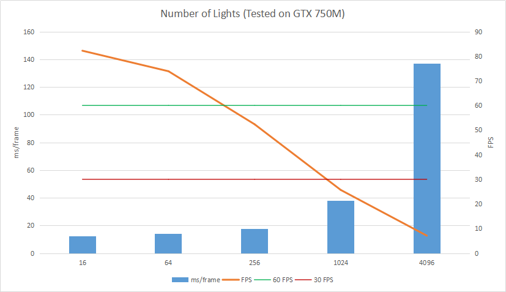

Forward Plus Rendering in Vulkan
================

**Final Project of CIS 565: GPU Programming and Architecture, University of Pennsylvania**

* [Liang Peng](https://github.com/itoupeter), [Zimeng Yang](https://github.com/zimengyang)
* Tested on: Windows 10, i7-4850 @ 2.3GHz 16GB, GT 750M (Personal Laptop)

# Overview

# Demo Video

[CLICK ME!](https://www.youtube.com/watch?v=w0gTf6PKHwI)

# Debug Views

|Light Heat Map|
|------|
||

Above heat map is demonstrating how much lights should be considered in each tile, brighter color means more lights in the tile.

|Texture Map|Normal Map|
|------|------|
|||

|Specular Map|Depth Texture|
|------|------|
|||

|Geometry Normal | After Normal Mapping|
|------|------|
|||

# Forward Plus Rendering

### Forward+ Overview
Forward+ improves upon regular forward rendering by first determining which lights are overlapping which area in screen space. During the shading phase, only the lights that are potentially overlapping the current fragment need to be considered.

*Forward Plus = forward + light culling*

Basically, in order to implement a light culling, we need to compute Grid Frustums to cull the lights into the screen space tiles.

### Grid Frustums

The screen is divided into a number of square tiles, for example, 16 * 16 screen pixels.

The above image shows that the camera’s position (eye) is the origin of the frustum and the corner points of the tile denote the frustum corners. With this information, we can compute the planes of the tile frustum.

### Grid Frustums Compute Shader

We need compute shaders to compute and grid frustums for each screen tile.

### Light culling

In the next step of the Forward+ rendering technique is to cull the lights using the grid frustums that were computed in the previous section.

Basic algorithm for light culling:

1. Compute the min and max depth values in view space for the tile
2. Cull the lights and record the lights into a light index list
3. Copy the light index list into global memory

### Frustum culling

**Frustum-sphere** for points lights, **Frustum-cone** for spot lights.

Computation details in [Forward+: Bringing Deferred Lighting to the Next Level](https://takahiroharada.files.wordpress.com/2015/04/forward_plus.pdf).

# Performance Analysis

Test schema:
 * Machine - i7-4850 @ 2.3GHz 16GB, GT 750M
 * Resolution - 1280 * 720
 * Triangles Count - 262267
 * Vertices Count - 184402
 * Materials Count - 25
 
### Tile Size

For the performance comparison of tile size, we choose from 8 by 8 to 256 by 256 pixels tile. Under same computation pipelines and graphics pipelines, performance data can be collected as above.

From different tests, we can see small tile size will introduce a lot of frustums to be computed and a lot of threads (compute shader) to do the computation for culling. But also a huge tile size will make the computation for each thread too heavy to make fully use of parallelization propertity of Vulkan compute shaders.

In conclusion, a reasonable tile size that fits best in different hardwares might be 16 by 16 or 32 by 32 pixels.

### Number of Lights

Under same test schema, we test the influence of different number of lights.

If we use basic Forward rendering, which is looping every in shading processure without light culling, the maximum number of lights that can be interactive is lower than 100 (under GTX 750M). But in forward+ rendering with light culling, the same machine will still be interactive with more than 1000 lights. In the deme video, which was tested under 965M a fancier graphics card, we can have near 100 FPS with 1024 dynamic lights in the scene. The benefits of forward+ light culling is very significant. 

With increase of light numbers, FPS drops but still remain real-time (>30) with more than 1000 lights. So Forward+ rendering does improve the overall performance and reduce the influence of huge amount of lights in the scene by light culling.

# Milestones 
### 11/21 - Basic Vulkan Application Framework
  * Vulkan environment setup and initialization
  * Basic rendering pipelines (multiple)
  * Vertex and index buffers (multiple)
  * Texture mapping (multiple) and model loading
  * Basic camera control
  * [Presentation Slides](./img/slides/milestone1.pdf)

### 11/28 - Basic Lighting in Vulkan / Debug Views
  * Debug views: depth, normal
  * Basic lighting: Lambert, Blinn-Phong
  * Compute pipeline in progress
  * [Presentation Slides](./img/slides/milestone2.pdf)

### 12/12 - Forward+
  * Compute pipeline
    * Compute grid frustum
    * Compute light list
  * Light culling
  * Shading
  * [Presentation Slides](./img/slides/milestone3.pdf)

# References:
1. [Vulkan Tutorial](https://vulkan-tutorial.com/)
2. [Vulkan Examples](https://github.com/SaschaWillems/Vulkan)
3. [Forward Plus Rendering](http://www.3dgep.com/forward-plus/)
4. [Graphics Models](http://graphics.cs.williams.edu/data/meshes.xml)
5. [Forward+: Bringing Deferred Lighting to the Next Level](https://takahiroharada.files.wordpress.com/2015/04/forward_plus.pdf)
